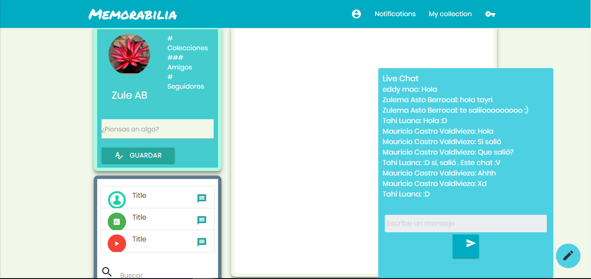
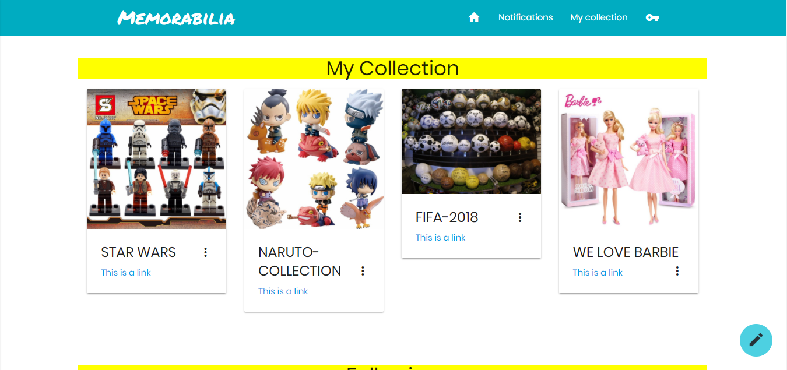
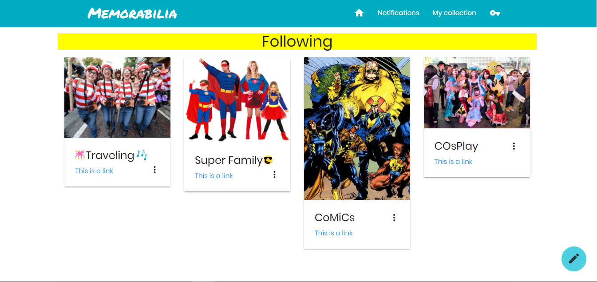

# Proyecto : Memorabilia

El pressente trabajo muestra el desarrollo de una aplicación con un enfoque visionario y atractivo denominado:

_"Memorabilia"_

App que reune a todos los colleccionistas  y a todos aquellos que desean compartir su invaluable tesoro al mundo .

**Pre Requisitos:**

 - Instalar el servidor de FireBase , que permitira obtener la data de los futuros usuarios. (recordar para esto tener conocimientos básicos en Node ,JS)

  <http://firebase.google.com/>

    

- Manejar javascript, css,html ,y el framework de tú preferencia (nosotras empleamos: Materialize )

  <http://materializecss.com/>

  

**Desarrollo:**

  - En primera instancia se desarrollo una encuesta a los futuros usuarios y cuales eran las necesidades que demandaban .

  - Procedimos con la  elaboración de los Sketch de nuestra futura app , donde se pudo observar el flujo de la informacion.

  - Se definio la presentacion y funcionalidad de la App.
    Funcionalidades :

    Permite al usuario registrarse ,tiene un perfil, una galeria de sus colecciones , un chat en tiempo real donde puede interactuar con sus seguidores.

  - Elaboración del código mobile friendly.

  Memorabilia :

  Home :

  

  My Collection :

  

  Following : 

  
